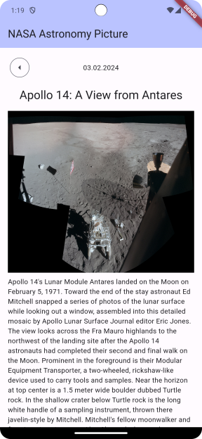
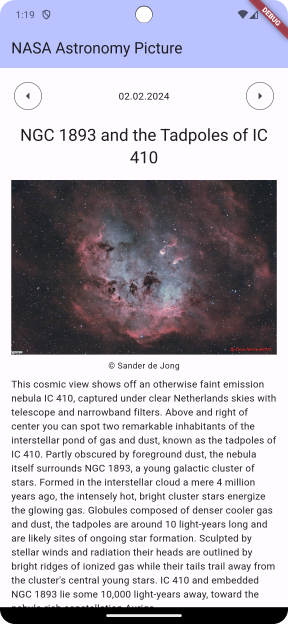

# Flutter app showing NASA's Astronomy Picture of the Day

A simple app I wrote to refresh/increase my Flutter knowledge.

* Explored multi-module approaches. `modules/api` is a separate Dart package encapsulating networking logic.
* Added `injectable` on top of `getIt`, which I already knew.
* Used `freezed` instead of `Equatable`.
* Initially explored Riverpod for state management, but went back to using Cubits.

 
